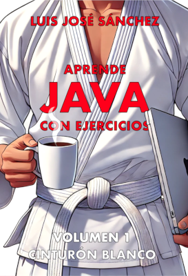
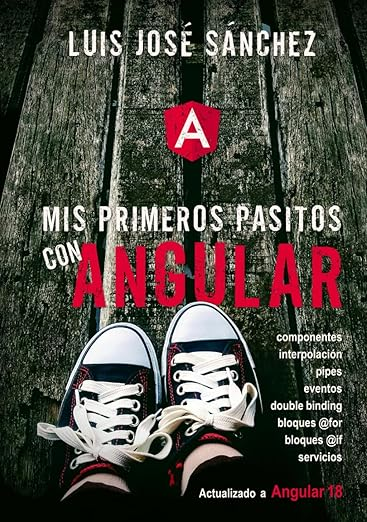
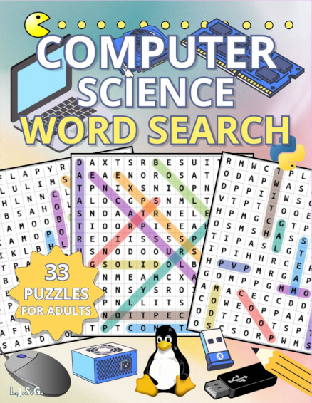

### Hi there! 👋🏻

I’m Luis José, a **Teacher and Full Stack Developer**. I have been CTO and co-founder of several tech companies. I'm always learning and looking for new challenges 🚀.

### About me 👨‍💻

```java
public class AboutMe {
  public static void main(String[] args) {
    final String ME = "Luis José Sánchez 🙋‍♂️";
    final String[] LANGUAGES = {"Java", "Typescript", "Javascript", "Python", "PHP", "SQL", "HTML", "CSS"};
    final String[] FRAMEWORKS = {"Angular", "Ionic"};
    final String[] INTERESTS = {"Teaching 👨‍🏫", "Coding 💻", "Going to the gym 🏋️‍♂️", "Running 🏃", "Cars 🚗", "Motorbikes 🏍️", "Vegetarian food 🥑"};
    final String CONTACT = "https://www.linkedin.com/in/luisjosesanchez/";
  }
}

```

### My books 📚

<a href="https://www.amazon.es/dp/B0DK38HCWR"></a>&nbsp;&nbsp;
<a href="https://www.amazon.es/dp/B0DK38HCWR"></a>

<a href="https://www.amazon.es/Computer-Science-Word-Search-fundamentals/dp/B0CZF3CCG5/">
  
</a>

<a href="https://leanpub.com/apirestnestjsmongodb">
  
</a>

<a href="https://leanpub.com/gitygithub/">
  
</a>

<a href="https://luisjose.org/assets/descargas/linux/linux_practical_manual_31_07_2014_en.pdf">
  
</a>

<!--
### My books in progress 🚧

<a href="https://leanpub.com/aprendeionic/">
  
</a>

<a href="https://leanpub.com/apuntesdejavascriptdees6aes10">
  
</a>
-->
